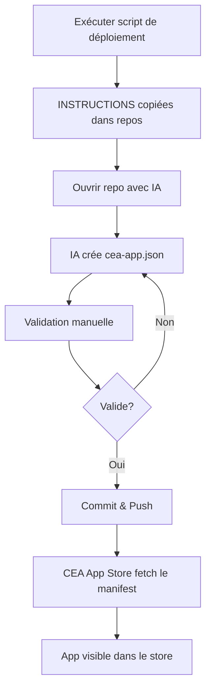

# 📦 Résumé du déploiement CEA App Manifest

## 🎯 Objectif

Automatiser le déploiement du système de manifestes `cea-app.json` dans tous les repos d'applications CEA.

---

## 📂 Fichiers créés

### Documentation
- ✅ `cea-app-template.json` - Template JSON complet
- ✅ `CEA-APP-GUIDE.md` - Guide détaillé pour les développeurs
- ✅ `INSTRUCTIONS-POUR-REPOS.md` - Instructions à déployer dans chaque repo
- ✅ `examples/listx-cea-app.json` - Exemple concret pour ListX

### Scripts de déploiement
- ✅ `scripts/deploy-instructions.ps1` - Script PowerShell
- ✅ `scripts/deploy-instructions.sh` - Script Bash
- ✅ `scripts/test-search.sh` - Script de test
- ✅ `scripts/README.md` - Documentation des scripts

### Code intégré
- ✅ `src/types/index.ts` - Types TypeScript pour CeaAppManifest
- ✅ `src/services/ceaAppService.ts` - Service de fetch/parse des manifestes
- ✅ `src/services/detectionService.ts` - Service de détection d'installation
- ✅ `src/services/githubService.ts` - Intégration des manifestes
- ✅ `electron/main.cjs` - Handler IPC pour détection
- ✅ `electron/preload.cjs` - Exposition de l'API

---

## 🔍 État des repos dans C:\DEV

### ✅ Repos trouvés
- **To-DoX** → `C:\DEV\To-DoX`
- **TONTONKAD-v2** → `C:\DEV\TONTONKAD-v2`

### ⚠️ Repos non trouvés dans C:\DEV
- **ListX** - Peut-être ailleurs ?
- **AUTONUM** - Peut-être ailleurs ?
- **RENDEXPRESS** - Peut-être ailleurs ?

### 📝 Autres dossiers suspects
- `tontonKAD_V2` - Doublon de TONTONKAD-v2 ?
- `tontonKAD_V3` - Nouvelle version ?

---

## 🚀 Déploiement automatique

### Option 1 : PowerShell (recommandé pour Windows)

```powershell
cd "C:\DEV\CEA APPSTORE\scripts"
.\deploy-instructions.ps1
```

### Option 2 : Bash (Git Bash / WSL)

```bash
cd "/c/DEV/CEA APPSTORE/scripts"
./deploy-instructions.sh
```

### Résultat attendu
Le script va :
1. Chercher les repos correspondants
2. Afficher ce qui sera fait
3. Demander confirmation (O/N)
4. Copier `INSTRUCTIONS-POUR-REPOS.md` dans chaque repo trouvé
5. Afficher un rapport

---

## 📝 Déploiement manuel (pour repos non trouvés)

Si certains repos sont ailleurs, copiez manuellement :

```powershell
# PowerShell
Copy-Item "C:\DEV\CEA APPSTORE\INSTRUCTIONS-POUR-REPOS.md" `
          -Destination "C:\chemin\vers\ListX\INSTRUCTIONS-POUR-REPOS.md"

Copy-Item "C:\DEV\CEA APPSTORE\INSTRUCTIONS-POUR-REPOS.md" `
          -Destination "C:\chemin\vers\AUTONUM\INSTRUCTIONS-POUR-REPOS.md"

Copy-Item "C:\DEV\CEA APPSTORE\INSTRUCTIONS-POUR-REPOS.md" `
          -Destination "C:\chemin\vers\RENDEXPRESS\INSTRUCTIONS-POUR-REPOS.md"
```

```bash
# Bash
cp "C:\DEV\CEA APPSTORE\INSTRUCTIONS-POUR-REPOS.md" "/chemin/vers/ListX/"
cp "C:\DEV\CEA APPSTORE\INSTRUCTIONS-POUR-REPOS.md" "/chemin/vers/AUTONUM/"
cp "C:\DEV\CEA APPSTORE\INSTRUCTIONS-POUR-REPOS.md" "/chemin/vers/RENDEXPRESS/"
```

---

## 🤖 Utilisation avec l'IA

### Pour chaque repo (après avoir copié INSTRUCTIONS-POUR-REPOS.md)

1. **Ouvre le repo** avec ton IA de code (Cursor, Claude, etc.)

2. **Donne ce prompt** :

```
Crée un fichier `cea-app.json` à la racine de ce repository en suivant
le template du fichier `INSTRUCTIONS-POUR-REPOS.md`.

Remplis toutes les informations spécifiques à cette application :
- Trouve le nom de l'app et son ID (kebab-case)
- Écris une description courte (max 100 caractères) et une longue
- Identifie où l'app s'installe en regardant la config electron-builder
- Trouve le nom exact du fichier setup dans les releases GitHub
- Détermine les chemins de détection (fichiers .exe, dossiers AppData)
- Mets à jour le changelog avec la version actuelle et ses changements

Assure-toi que :
- Les chemins de détection correspondent à l'installation réelle
- Les URLs GitHub sont correctes
- Le JSON est valide et bien formaté
- Tous les champs obligatoires sont remplis
```

3. **Vérifie** le fichier généré avec la checklist dans INSTRUCTIONS-POUR-REPOS.md

4. **Teste** les URLs et les chemins

5. **Commit et push**

---

## ✅ Checklist de validation finale

Avant de pousser le `cea-app.json` dans un repo, vérifie :

### Structure
- [ ] Le fichier est à la racine du repo
- [ ] Le JSON est valide (pas d'erreur de syntaxe)
- [ ] Tous les champs obligatoires sont présents

### Identité
- [ ] `app.id` est unique et en kebab-case
- [ ] `app.version` suit le format X.Y.Z
- [ ] `app.name` correspond au nom affiché de l'app

### Ressources
- [ ] URL du logo est accessible (teste dans le navigateur)
- [ ] URL de l'icône est accessible
- [ ] Les chemins relatifs existent dans le repo

### Détection (CRUCIAL)
- [ ] Les chemins de fichiers `.exe` sont corrects
- [ ] Les dossiers AppData utilisent les bonnes variables (%APPDATA%, etc.)
- [ ] La priorité est définie (files/directories/registry)
- [ ] Au moins une méthode de détection est fournie

### Installation
- [ ] L'URL de téléchargement est valide
- [ ] Elle pointe vers `/releases/latest/download/`
- [ ] Le nom du fichier setup correspond à la réalité

### Métadonnées
- [ ] La catégorie est correcte
- [ ] Les tags sont pertinents
- [ ] L'URL du repository est correcte

### Changelog
- [ ] La version actuelle a une entrée
- [ ] La date est au format YYYY-MM-DD
- [ ] Les changements sont listés

---

## 🔄 Workflow complet



---

## 📊 Suivi de déploiement

| Repo | Trouvé ? | Instructions copiées | cea-app.json créé | Testé | Poussé |
|------|----------|---------------------|-------------------|-------|--------|
| **To-DoX** | ✅ | ⏳ | ⏳ | ⏳ | ⏳ |
| **TONTONKAD-v2** | ✅ | ⏳ | ⏳ | ⏳ | ⏳ |
| **ListX** | ❓ | ⏳ | ⏳ | ⏳ | ⏳ |
| **AUTONUM** | ❓ | ⏳ | ⏳ | ⏳ | ⏳ |
| **RENDEXPRESS** | ❓ | ⏳ | ⏳ | ⏳ | ⏳ |

Légende :
- ✅ Fait
- ⏳ À faire
- ❓ Non trouvé / À localiser
- ❌ Erreur

---

## 🎉 Résultat final

Une fois tous les repos mis à jour avec leur `cea-app.json` :

1. **L'App Store** récupère automatiquement les infos depuis GitHub
2. **La détection** fonctionne pour savoir si l'app est installée
3. **Les métadonnées** sont toujours à jour (version, description, changelog)
4. **Plus besoin** de hardcoder les infos dans le code de l'App Store

Chaque app devient **autonome** et gère ses propres métadonnées ! 🚀

---

## 📞 Support

- Guide complet : [CEA-APP-GUIDE.md](CEA-APP-GUIDE.md)
- Instructions pour les repos : [INSTRUCTIONS-POUR-REPOS.md](INSTRUCTIONS-POUR-REPOS.md)
- Scripts : [scripts/README.md](scripts/README.md)
